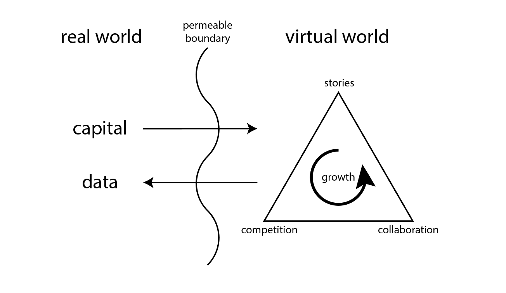

We propose a new perspective for building blockchain games based on world-centric game design. World-centric design emphasizes game mechanics that create a dynamic and interesting world rather than game mechanics that serve the player experience. For example, the table below illustrates world-centric versions of common place game mechanics.

|  player-centric mechanics |  world-centric mechanics             |
|---------------------------|--------------------------------------|
| replenishing resources    | finite resources                     |
| revival                   | permanent death                      |
| fast travel               | cartesian topology (no fast travel)  |
| NPC marketplaces          | player run marketplaces              |

Blockchain is an ideal environment for building world-centric games. Decentralization, self-sovreignty and code-as-law are foundational values to the platform. Thus, the blockchain game experience is ultimately driven by the emergent reality of its code rather than the intentions of its developers.

Furthermore, economies create real-world incentive to drive player decision making. Primary and secondary markets will fairly and entirely determine the value of any in game asset based solely on the collective valuation of the players. World-centric blockchain games thus translates to dynamic virtual economies that are exchangeable for and measurable in real world fiat.

In a traditional view, transactions in blockchain games are understood in-game actions. For the player, this interface is unfamiliar, expensive, and generally speaking a bad experience. Instead, we suggest understanding in-game actions as economic transactions of a rational player controlled agent. This interpretation seems promising if we consider the fact that blockchain games have yet to see mass adoption whereas decentralized exchanges are heavily used.

Finally, along side fiat-measurable assets, world-centric virtual worlds also safely generate valuable data as models for new markets with mechanism design limited only by the developer's imagination. In this regard, real world value flows into the game while innovative market driven narratives flow out. At worst, these are exciting stories for players to share; at best, these experiences might inform our real world economic policies.

A more precise example is better summarized in one picture:

At the start, external capital collateralizes the player's attention (perhaps through game sales, an ICO, airdrop, or plain marketing) and bootstraps the virtual world's economy.

With its initial state set, players compete and collaborate in the virtual world ultimately growing its economy and generating stories of value.

These virtual worlds can serve as playgrounds for new forms social organization. The stories provide valuable data on new economic mechanisms that might serve us in practice.

We summarize the goals of world-centric blockchain game design as follows:

1. To create self-sustaining economies where players compete and collaborate to grow an economically driven world narrative.
2. That these virtual worlds are dynamic, interesting and fun for players to explore.
3. To use these virtual worlds as models for radical markets with multiple agents incentivized by digital assets measurable in fiat currency.

# Repo
The documents in this repo is still a work in progress. For now, you can check the [Potato CBG design doc](https://github.com/pdlla/P2CBG_design/blob/master/potatocbg/README.md) which exemplifies this design perspective. There is also the [Potato Survival design doc](https://github.com/pdlla/P2CBG_design/blob/master/potato_survival.md). The rest of the documents in this repo are unfinished. They will be linked here once they are complete. At a high level, you can look forward to:

1. more documents elaborating this design perspective for both a blockchain and game theoretic perspective
2. detailed spec for Potato CBG MVP
3. EVM compatible code for Potato CBG MVP

You can also read more about world-centric game design [here](http://pdlla.org/posts/writing/2015-3_CBG.html).
